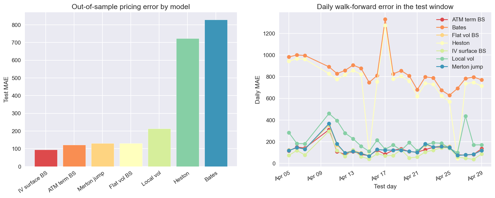
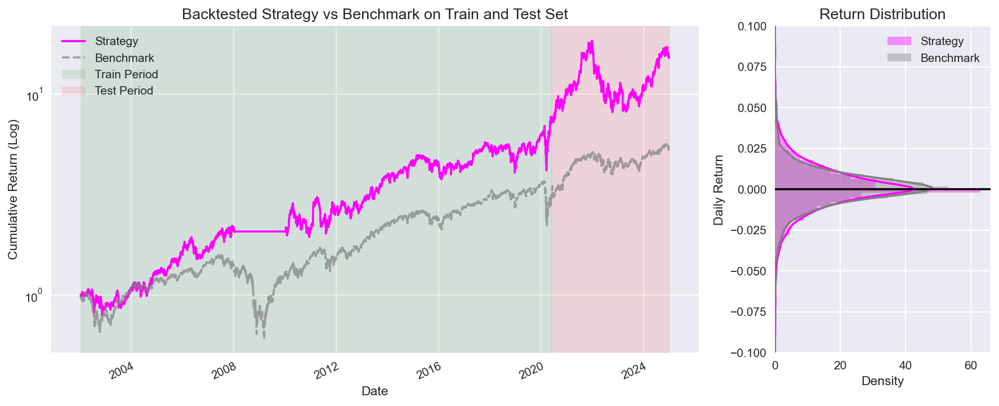

# Finance

## Black Scholes Application and Extensions in Crypto

Option pricing on Deribit BTC USDC options from the `with_iv` parquet feed (~100 GB, 83 day partitions). The notebook builds Black-Scholes from scratch, constructs the implied vol smile and surface, implements Dupire local vol, Merton jump diffusion, Heston, and Bates, and compares all models in a daily walk-forward: calibrate on the trailing five days, price the next day unseen.

[Open notebook](Black%20Scholes%20Application%20and%20Extensions%20in%20Crypto.ipynb)

## Momentum Strategy USA

Point-in-time S&P 500 cross-sectional momentum research pipeline using WRDS/CRSP data, with transaction costs applied throughout. Tested roughly 2,000 parameter combinations, selected robust configurations with an out-of-sample walk-forward split, and finished with Fama-French factor attribution plus a tearsheet to show performance, drawdowns, and risk behaviour.

[Open notebook](Momentum%20Strategy%20USA.ipynb)