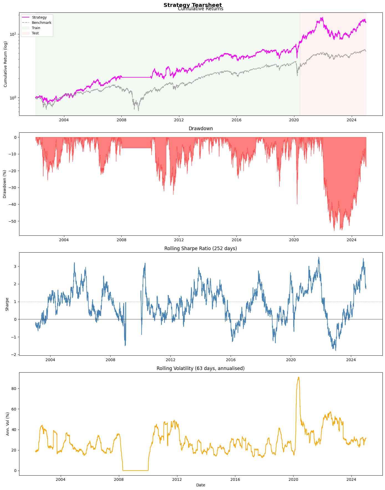

# Finance

## Momentum Strategy USA

I built a point-in-time S&P 500 cross-sectional momentum research pipeline using WRDS/CRSP data, with transaction costs applied throughout. I tested roughly 2,000 parameter combinations, selected robust configurations with an out-of-sample walk-forward split, and finished with Fama-French factor attribution plus a tearsheet to show performance, drawdowns, and risk behaviour.

